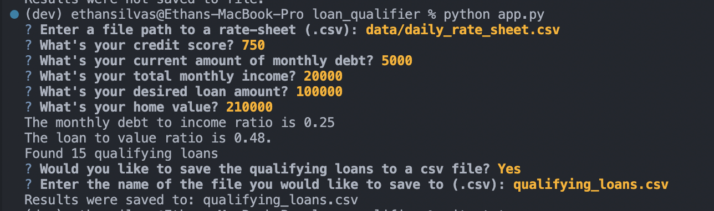
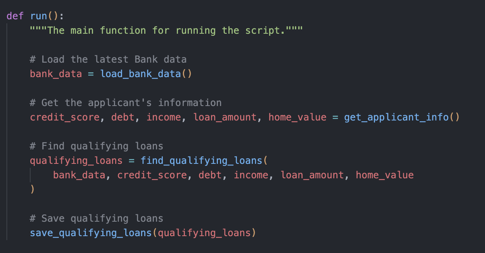

# Module 2 Challenge - Loan Qualifier 

This program is an automated loan qualifier that has an interactive CLI which allows users to test which banks their loan would qualify at. There is dynamic functionality that allows the user to provide bank data and opt to save the qualifying loan data to an external file. 

---

## Technologies

This is a Python 3.7 project

The following dependencies are used: 

[Python Fire](https://github.com/google/python-fire) (0.4.0) - for intuitive and easy creation of the project's CLI <br>
[Questionary](https://github.com/tmbo/questionary) (1.10.0) - to create CLI prompts/interactions to handle user input 

---

## Installation Guide

To install each of the required dependencies, run the following commands: 

```
pip install fire
pip install questionary
```

---

## Usage

To begin using this program, start the app by running app.py in your terminal like so: 

```python
python app.py
```

You will then be prompted to enter all the information needed to calculate loan worthiness. Type your response to each one and press enter to move on to the next prompt.

Here is an example of a successful run of the program resulting in loans being saved to a provided file: 


There are four main functionalities that the loan qualifier achieves: 

1. Loading bank data from a user provided (and locally stored) .csv file <br>
    
    `load_bank_data()` utilizes Python's standard csv library to read in and store data from the provided .csv file. 


2. Prompt the user to input their loan data via Questionary functions

    `get_applicant_info()` holds many Questionary prompts to gather the user's loan info for data like credit score, debt, income, loan amount, and home value. 

3. Filter the provided bank data and return the banks that would underwrite the loan

    `find_qualifying_loans(bank_data, credit_score, debt, income, loan, home_value)` uses the data returned from the Questionary prompts to then filter down the list of banks to only those that accept loans matching the user's credit score, debt to income ratio, loan to value ratio, and the bank's max loan size. 

4. Ask the user if they would like to save the resulting banks to a file and do so if needed

    `save_qualifying_loans(qualifying_loans)` is the newly added function that uses Questionary to ask the user if they would like to save the filtered list of banks to a file. 

These functionalities are organized with the main `run()` function:


---

## Contributors

[Ethan Silvas](https://github.com/ethansilvas)

---

## License

This project uses the [GNU General Public License](https://choosealicense.com/licenses/gpl-3.0/)
